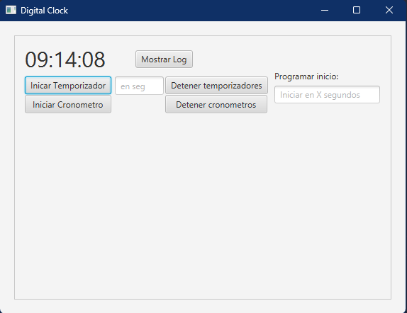
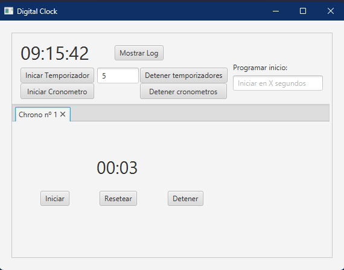
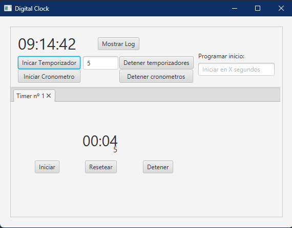
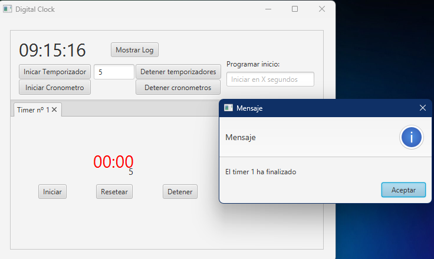
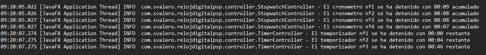

# Reloj Digital 
#### Entrega de semana de practicas para programacion de servicios y procesos.
***
###### Menu principal

- Reloj digital que se actualiza cada 500ms 
- Posibilidad de iniciar cronometros mediante el pulsador "Iniciar Cronometro"
- Posibilidad de iniciar temporizadores introduciendo el tiempo en segundos y pulsando en iniciar temporizador
- Posibilidad de programar el inicio escribiendo en el campo el tiempo en segundos para que se inicie
- Posibilidad de detener todos los cronometros a la vez sin perder los valores
- Posibilidad de deter todos los temporizadores a la vez sin perder los valores
- Posibilidad de visualizar los registros de detencion de temporizadores y cronometros en un log
***
###### Cronometro

Al iniciar un cronometro este se arranca automaticamente y empieza a contar. 
Aparece una nueva pestaña con el numero de cronometro que estamos ejecutando y el valor actual del mismo.
Podemos actuar sobre el detentiendolo sin perder el valor y guardandolo en el log, reseteandolo a 0 y en el caso de estar detenido, reanudarlo.

***
###### Temporizadores

Al iniciar un temporizador con un tiempo este se arranca automaticamente y empieza a contar.
Aparece una nueva pestaña con el numero de temporizador que estamos ejecutando y el tiempom restante del mismo. 
Tambien tenemos el valor inicial de segundos que hemos cargado incialmente.
Podemos actuar sobre el detentiendolo sin perder el valor y guardandolo en el log, reseteandolo a 0 y en el caso de estar detenido, reanudarlo.

Cuando un temporizador llega a 0, aparece una ventana emergente que indica el numero de temporizador que ha finalizado.
Ademas, texto que representa el tiempo restante en la ventana del temporizador cambia de color a rojo.

***
###### Registro de valores

Al detener cualquier elemento se guarda en un fichero el tiempo acumulado o restante. Tambien guardamos la hora en la que esto ha ocurrido y se puede identificar cada temporizador o cronometro mediante su id.

